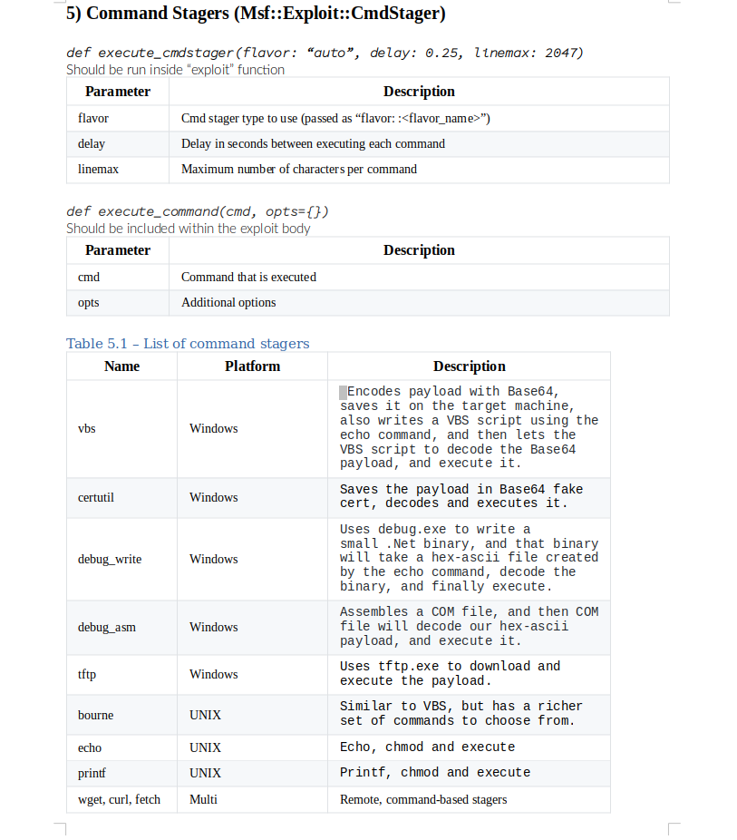

<h1 align="center"> MSF Exploit Dev Cheatsheet </h1>  

  

  This document is a reference that congregates various functions, variables, code snippets and tips that are useful when writing exploits using Metasploit Framework. It isn't completed yet (or even half-way done) so each and every pull request is welcome.

